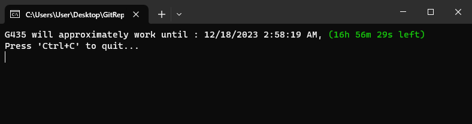

# G435 battery approximate
simple monitor app to approximate battery level of G435, tell how much time you have until battery need to recharge. Assume battery full when start approximation.

## Approximate Options : 
1) From the last pc boot time : use when you start G435 and PC at the same time.
2) From the last saved date time : use when you start G435 from saved date time.
3) From the current date time (overwrite last saved date time) : use when you want to restart the approximation and battery is full.

## Support
- Windows only
